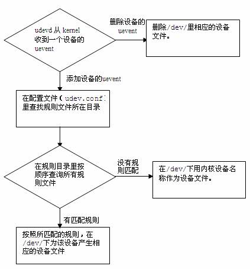

# udev



### 创建monitor

```
#include <libudev.h>

struct udev_monitor *udev_monitor_new_from_netlink(struct udev *udev, const char *name);
```
name="kernel" or "udev"

### 接受设备事件

```
struct udev_device *udev_monitor_receive_device(struct udev_monitor *udev_monitor);
```